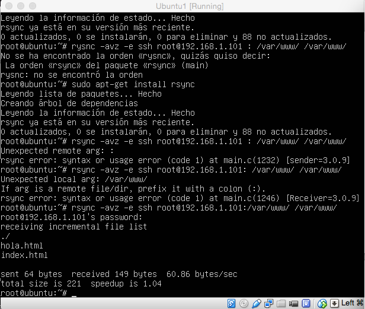
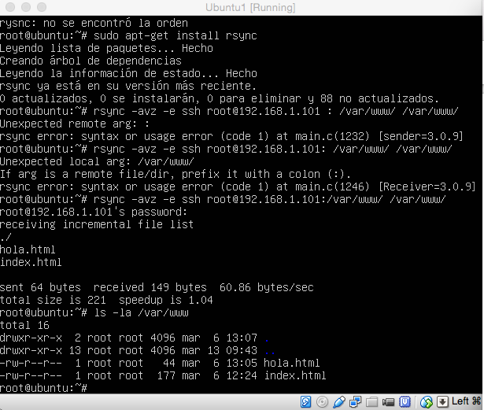
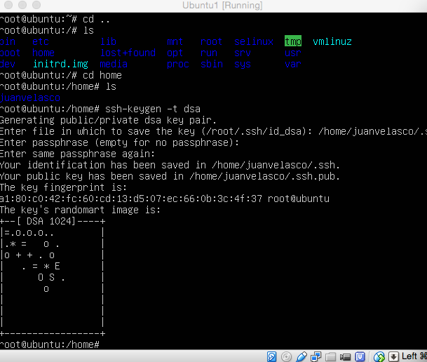
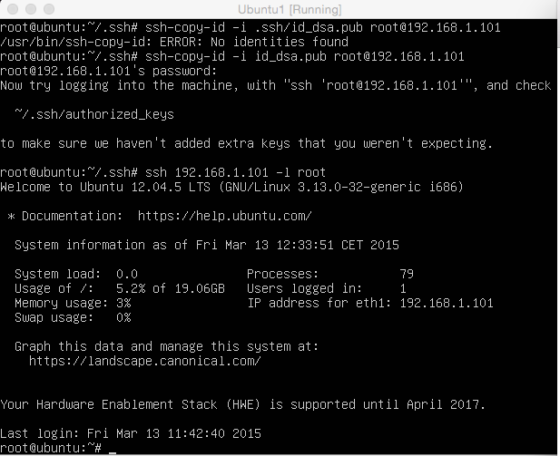
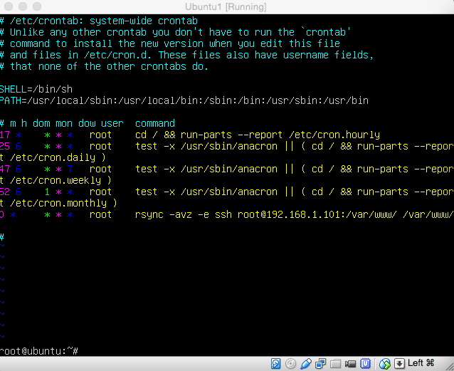

**Práctica 2:** Clonar la información de un sitio web
==================

- Realizado por:
	+ Juan Antonio Velasco Gómez
	+ Miguel Sanchez Maldonado

En primer lugar, para comprobar la copia de ficheros, hemos creado un archivo tar.gz de un equipo para dejarlo en el otro.

	tar czf - directorio | ssh equipodestino 'cat > ~/tar.tgz'

Puesto que la herramienta rsync ya estaba instalada en nuestras máquinas, hemos clonado una carpeta cualquiera, en este caso la del ejemplo que el guión nos proporcionaba. (desde root para tener permiso)

	rsync -avz -e ssh root@maquina1:/var/www/ /var/www/

Comprobamos que el archivo clonado esta en la otra máquina
	
	ls -la /var/www

Buscamos ahora acceder sin contraseña para ssh, para ello usaremos ssh-keygen para generar la clave (con la opción -t elegimos el tipo de clave)

	ssh-keygen -t dsa

La captura de pantalla 4 - "Conectarse como root en la otra máquina" muestra como hemos sido capaces de conectarnos como superusuario o root desde la máquina 1 en la máquina 2.

Lo último que se nos pide es programar una tarea con crontab. En este caso, programaremos en cron que se ejecute cada hora para mantener actualizado el contenido del directorio /var/www entre las dos máquinas.

Esto lo hemos hecho editando el archivo /etc/crontab como se ve en la captura de pantalla correspondiente

