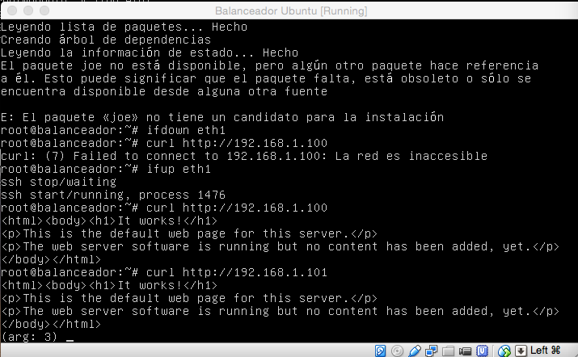
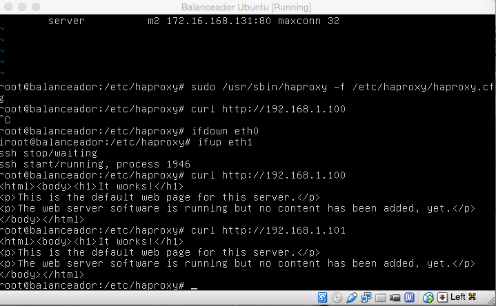

**Práctica 3:** Balanceo de carga
==================

- Realizado por:
	+ Juan Antonio Velasco Gómez
	+ Miguel Sanchez Maldonado

1. Instalando Nginx como balanceador
------------------

Primero buscamos configurar una máquina e instalarle nginx como el balanceador de carga.

Creamos una nueva máquina virtual réplica de las anteriores y la llamamos "Balanceador". Procedemos a instalar nginx en Ubuntu Server 12.04.

Lo primero que debemos hacer es importar la clave del repositorio de software:

	cd /tmp/
	wget http://nginx.org/keys/nginx_signing.key
	apt-key add /tmp/nginx_signing.key
	rm -f /tmp/nginx_signing.key

Escribimos las dos siguientes órdenes que añaden el repositorio.

	echo "deb http://nginx.org/packages/ubuntu/ lucid nginx" >> /etc/apt/sources.list
	echo "deb-src http://nginx.org/packages/ubuntu/ lucid nginx" >> /etc/apt/sources.list

Ahora ya podemos instalar el paquete del nginx:

	apt-get update
	apt-get install nginx

2. Configuración de Nginx como balanceador
------------------

La configuración inicial de nginx no nos vale tal cual está, modificamos el fichero */etc/nginx/conf.d/default.conf*, añadiendo:

	upstream apaches {
	 server 172.16.168.130;
 	 server 172.16.168.131;
	}

Configuramos nginx para indicarle que use ese grupo definido para pasarle las peticiones.

	server{
	 listen 80;
	 server_name m3lb;
	 access_log /var/log/nginx/m3lb.access.log;
	 error_log /var/log/nginx/m3lb.error.log;
	 root /var/www/;
	 location /
	 {
		 proxy_pass http://apaches;
		 proxy_set_header Host $host;
		 proxy_set_header X-Real-IP $remote_addr;
		 proxy_set_header X-Forwarded-For $proxy_add_x_forwarded_for;
		 proxy_http_version 1.1;
		 proxy_set_header Connection "";
	 }
	}

3. Comprobar el funcionamiento de Nginx como balanceador
------------------

Y **reiniciamos nginx**

	sudo service nginx restart

Y probamos su buen funcionamiento haciendo peticiones a la IP de esta máquina

	curl http://192.168.1.100
	curl http://192.168.1.101

Podemos ver el resultado de estas peticiones en la siguiente captura de pantalla

4. Instalando haproxy como balanceador
------------------

Para instalar haproxy únicamente tenemos que escribir

	sudo apt-get install haproxy joe

5. Configuración de haproxy como balanceador
------------------

Modificamos el fichero */etc/haproxy/haproxy.cfg* puesto que la configuración inicial no nos vale.  

	cd /etc/
	cd haproxy/
	ifconfig
	sudo joe haproxy.cfg 

Y a continuación lo editamos escribiendo: 

	global
		daemon
		maxconn 256
	defaults
		mode http
		contimeout 4000
		clitimeout 42000
		srvtimeout 43000
	frontend http-in
		bind *:80
		default_backend servers
	backend servers
		server m1 192.168.1.100:80 maxconn 32
		server m2 192.168.1.101:80 maxconn 32

6. Comprobar el funcionamiento de haproxy como balanceador
------------------

Lanzamos el servicio haproxy escribiendo en la terminal

	sudo /usr/sbin/haproxy -f /etc/haproxy/haproxy.cfg

De no salir ningún error o aviso sabemos que todo ha ido bien y podemos hacer las peticiones a la IP del servidor

	curl http://192.168.1.100
	curl http://192.168.1.101

Podemos ver el resultado de estas peticiones en la siguiente captura de pantalla

