**Práctica 5:** Replicación de bases de datos MySQL
==================

- Realizado por:
	+ Juan Antonio Velasco Gómez
	+ Miguel Sánchez Maldonado

1. Crear una Base de Datos 
------------------

Comenzamos la práctica creando una base de datos en MySQL .
Le realizamos mediante línea de comandos del MySQL tal y como se nos indica en el guión de la práctica

	create database contactos;
	use contactos;

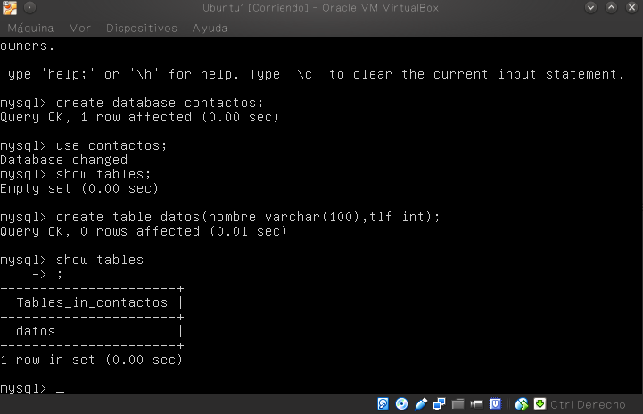

y que nos muestre los datos de la BD

    show tables;

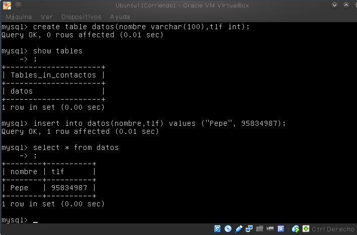

Podemos observar que hemos puesto el nombre de contactos a la base de datos.
Si luego queremos entrar en hacer una consulta para entrar

    mysql -uroot -p
    
A continuación en la Máquina 1 o máquina servidora entramos a la base de datos y ejecutamos

	mysql> FLUSH TABLES WITH READ LOCK;
	mysql> quit
    
y ahora guardamos los datos en el servidor pricipal

    mysqldump contactos -u root -p > /root/contactos.MySQL

Ahora ya podemos desbloquear las tablas que habiamos bloqueado
entramos a la base de datos y ejecutamos

	mysql>UNLOCK TABLES;
	mysql> quit
    
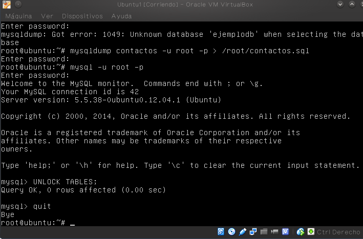

Llegados a este paso nos vamos a la máquina 2 que será la esclava para copiar el archivo .sql con los 
datos que ya hemos salvado en la máquina 1, tenemos que poner la dirección IO de la máquina servidora
    
    scp root@192.168.1.100:/root/contactos.sql /root/

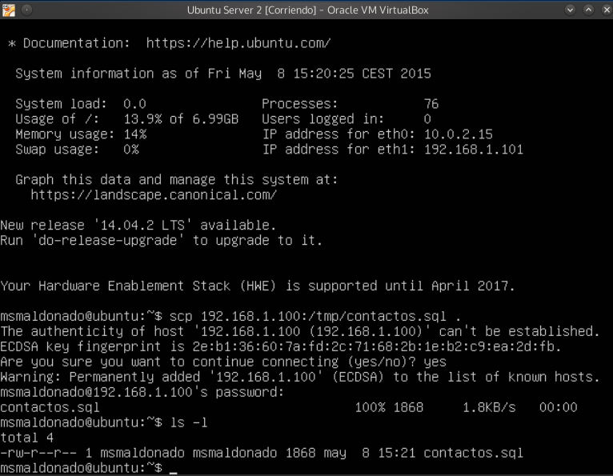

Vamos a importar la BD en MySQL pero la orden mysqldump no incluye la sentencia para crear la 
base de datos, asi que nosotros primero tenemos que crearla, entramos y ejecutamos :

	mysql> CREATE DATABASE 'contactos';
	mysql> quit

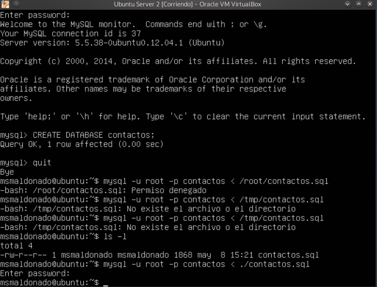
    
    
Ahora si podemos restaurar la BD

2. Configuración Esclavo-Maestro 
------------------

Tenemos que configurar el servidor principal y el secundario.
Comenzamos por el **maestro** como root para modificar el archivo de configuracion

	vim /etc/mysql/my.cnf
    
- Lo primero será comentar el bin-address y añadimos la siguiente línea para indicar donde se almacenarán los errores

	log_error= /var/log/mysql/error.log

- Establecemos el identificador del servicio

	server-id = 1 

- Añadimos el registro binario ya que es más seguro para las transacciones

	log_bin=var/log/mysql/bin.log_bin
	
- Guardamos el documento y reiniciamos

	/etc/init.d/mysql restart

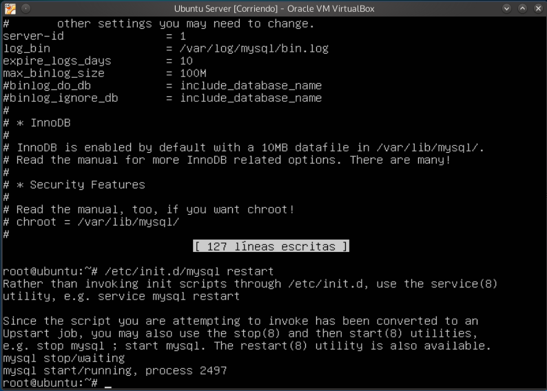
	
**Configuracion del esclavo**

Tenemos que repetir el proceso anterior del maestro salvo en el identicador de servicio que ahora será:

	server-id = 2

Guardamos y reiniciamos.

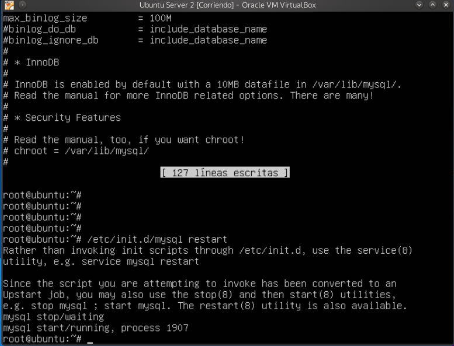

Una vez realizado esto correctamente nos vamos de nuevo al maestro para ahora crear un usuario y
darle permisos de acceso para la replicacion.

	CREATE USER esclavo IDENTIFIED BY 'esclavo';
	GRANT REPLICATION SLAVE ON *.* TO 'esclavo'@'%'IDENTIFIED BY'esclavo';
	FLUSH PRIVILEGES;
	FLUSH TABLES;
	FLUSH TABLES WITH READ LOCK;
     
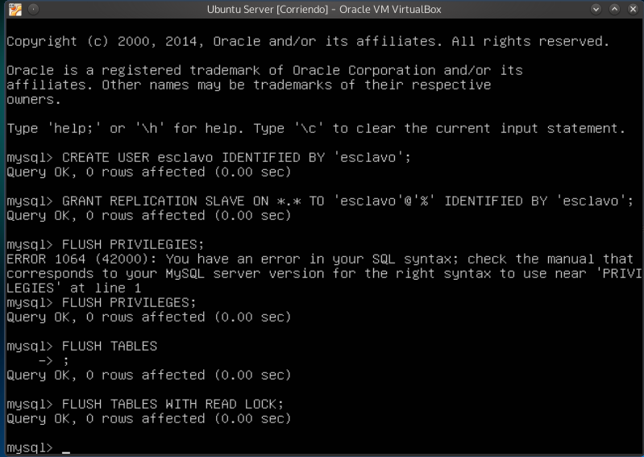

- Obtenemos los datos de la base de datos que vamos a replicar

	SHOW MASTER STATUS;

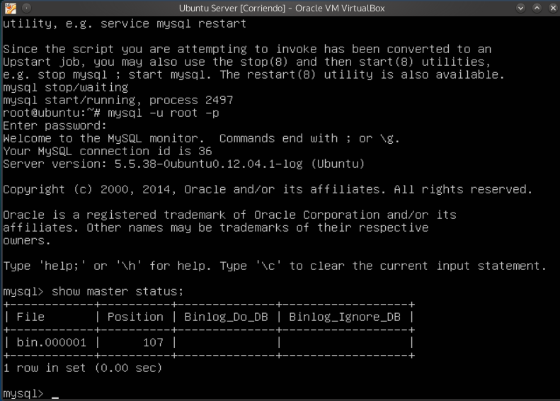
    
Ahora en la máquina esclava, entramos en mysql y ponemos los datos del maestro con la sentencia:

	CHANGE MASTER TO MASTER_HOST='192.168.1.100',
	MASTER_USER='esclavo',
	MASTER_PASSWORD='esclavo',
	MASTER_LOG:FILE='mysql-bin.000001',MASTER-LOG_POS=501,
	MASTER_PORT=3306;

- Arrancamos el esclavo

	START SLAVE

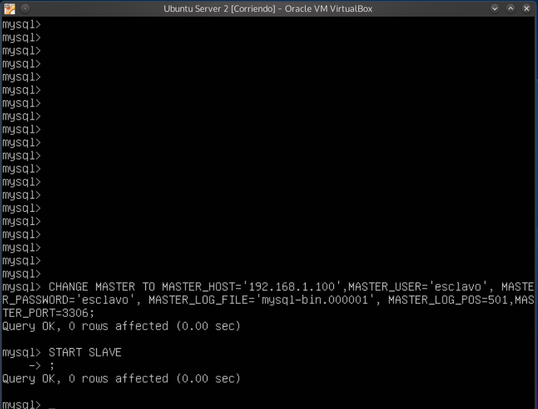

- Y por último en el maestro, le damos acceso a las tablas.

	UNLOCK TABLES;

Comprobamos que todo funciona correctamente, para ello desde el esclavo:

	mysql> SHOW SLAVE STATUS\G

 Y vemos que Seconds_Behind_Master es distinto de null

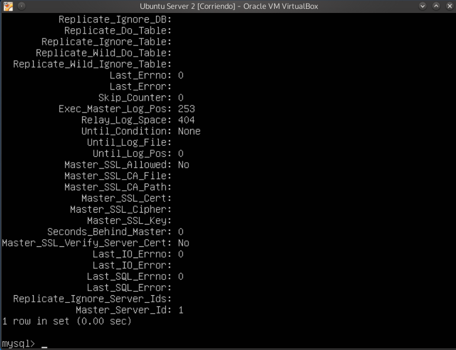