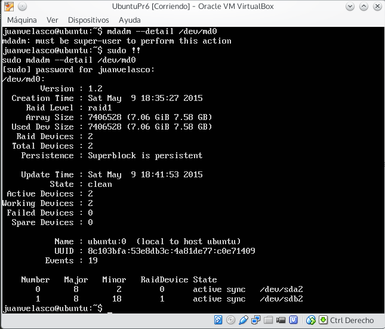

**Práctica 6:** Discos en RAID
==================

- Realizado por:
	+ Juan Antonio Velasco Gómez
	+ Miguel Sánchez Maldonado

1. Preparando la configuración
------------------

Comenzamos instalando de nuevo una máquina de UbuntuServer, vamos a obviar el proceso de instalación ya que se ha realizado en las distintas prácticas. Durante la instalación de UbuntuServer nos centraremos principalmente en la instalación del RAID.

Creamos dos discos vacíos del mismo tamaño antes del proceso de instalación. Para cada uno de ellos elaboraremos el siguiente proceso:

*Disco 1*

Para ello vamos a la pantalla "Particionado de discos" --> "Manual", seleccionamos un disco y le decimos que queremos crear una nueva partición. Hacemos click sobre espacio no particionado y elegimos la opción "Crear una partición nueva".

En este caso, establecemos un espacio de 1GB  y elegimos el tipo de partición "Primaria". En ubicación seleccionamos "Principio" En la siguiente pantalla que nos salga le damos a "Utilizar como:" y seleccionamos "área de intercambio". Por -ultimo seleccionamos "Se ha terminado de definir la partición".

Una vez de vuelta en la pantalla principal de particionado seleccionamos de nuevo el espacio libre (en nuestro caso 7,6 GB) y le damos otra vez a "Crear una partición nueva". Esta vez elegimos todo el espacio que nos quedaba libre y la ponemos como "Primaria". En la pantalla de configuración de la partición en "Utilizar como:" elegimos "volumen físico para RAID"

Le damos ahora a "Se ha terminado de definir la partición"

*Disco 2*

Repetimos de nuevo el proceso que hicimos en el disco 1 para el disco 2. Tenemos que dejarlo exactamente igual.

2. Configuración del RAID por software 
------------------

En el menú principal hacemos click en "configurar RAID por software" y le daremos a "Sí" para escribir los cambios. El siguiente paso será crear un dispositivo MD que llamaremos RAID1. En el número de dispositivos le ponemos 2 y en el libres 0.  Es la opción que viene por defecto.

Elegimos ahora las 2 particiones que formarán el RAID1 (no las de intercambio) y le damos a "Terminar".

Al volver a la ventana principal de particionado veremos como tenemos un nuevo dispositivo RAID1. Hacemos click sobre él para asignarle un sistema de ficheros y un punto de montaje.

	En  "Utilizar como:" seleccionamos "sistema de ficheros ext4 transaccional".
	En "Punto de montaje:" seleccionamos "/ - sistema de ficheros raiz".

Seleccionamos que hemos terminado de definir la partición y terminamos el proceso de instalación de nuestra máquina virtual.

Comprobamos que hemos instalado el raid de forma satisfactoria escribiendo:

	mdadm --detail /dev/md0

